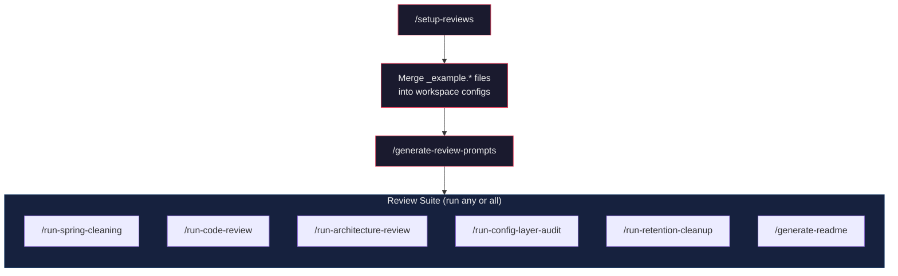
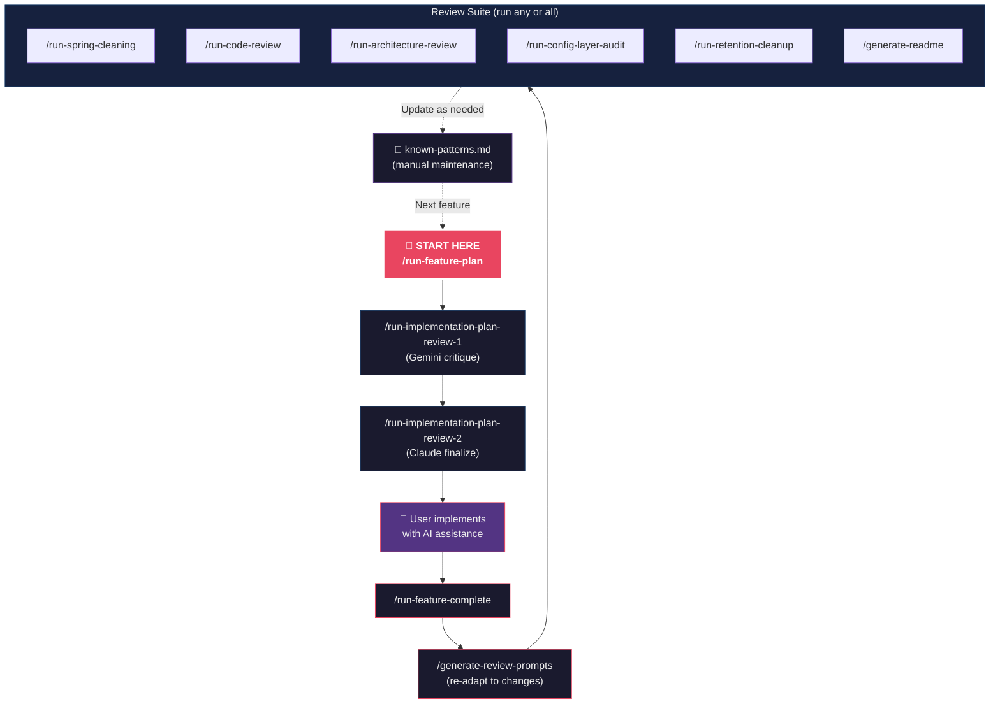

# 🌌 Antigravity Self-Evolving Reviews

> Antigravity 2 plugin that makes your AI code reviews **smarter over time**. Meta-prompts analyze your codebase and generate hyper-specific review workflows — perfectly tailored to your stack, architecture, and team standards.

> [!NOTE]
> **Opinionated by design.** This plugin is built around the **Vibe Coding** philosophy — a coding methodology optimized for AI-assisted solo development. Concepts like the 10-Second Rule, God Component thresholds, and the Vibe Score are core to every review workflow. If your team follows a different methodology, you can [customize the meta-prompts](#-customization) or fork the plugin.

  


---

## 🧠 What Is This?

Most AI code review prompts are generic. They don't know your database schema, your monorepo structure, or why you use `as any` in exactly one place in your Sequelize queries.

> [!NOTE]
> **Target Audience:** This plugin is specifically designed for **vibe coders**, especially solo developers who do not have the luxury of working with a peer reviewer. It is **not** intended for team development environments with formal pull request review portals or extensive peer review procedures.

This plugin solves that by introducing a **meta-prompt pipeline**:

1. **Meta-prompts** analyze your actual codebase (file structure, stack, patterns, dependencies).
2. They **generate** hyper-specific prompts, saved directly into your workspace.
3. The **skills** execute those generated prompts — producing reports and plans that actually understand your project.

Because the meta-prompts regenerate the prompts on demand, your workflows **self-evolve** as your codebase changes.

---

## ✨ Features

### 🔄 Meta-Prompt-Backed Skills

*These skills read from a generated, workspace-specific prompt. Run `/generate-review-prompts` after setup to activate them.*

> [!TIP]
> Run `/generate-review-prompts` whenever a new feature is implemented or your tech stack changes. This includes changes to the workspace codebase itself, as well as introducing new MCP servers or custom skills in AntiGravity, ensuring your review prompts remain adapted to both your code and your execution environment.

| Skill                           | Command                    | Description                                                                       |
| ------------------------------- | -------------------------- | --------------------------------------------------------------------------------- |
| 🔍 **Run Code Review**          | `/run-code-review`         | High-fidelity Vibe Coding compliance review with graded Vibe Report               |
| 🌸 **Run Spring Cleaning**      | `/run-spring-cleaning`     | Dead code, unused dependencies, and stale file analysis                           |
| 🏗️ **Run Architecture Review** | `/run-architecture-review` | Full-spectrum architectural audit using live MCP data                             |
| 📖 **Generate README**          | `/generate-readme`         | Regenerates README.md from actual codebase state                                  |
| ✅ **Run Feature Complete**      | `/run-feature-complete`    | Updates all documentation, changelog, and project artifacts after a feature ships |
| 🗺️ **Run Feature Plan**        | `/run-feature-plan`        | Pre-flight reconnaissance + full-stack implementation plan for a new feature      |

### ⚡ Static Skills

*These skills are intentionally workspace-agnostic. They do not use a generated prompt — see [Why Some Skills Are Static](#-why-some-skills-are-static).*

| Skill                          | Command                             | Description                                                                      |
| ------------------------------ | ----------------------------------- | -------------------------------------------------------------------------------- |
| 🗂️ **Run Config Layer Audit** | `/run-config-layer-audit`           | Harmonizes GEMINI.md, skills, docs, and Knowledge Base using the Decision Matrix |
| 📋 **Plan Review 1**           | `/run-implementation-plan-review-1` | Gemini-role critique of Claude's implementation plan                             |
| 📋 **Plan Review 2**           | `/run-implementation-plan-review-2` | Claude finalizes the battle-tested master implementation plan                    |

### 🛠️ Utility Skills

| Skill                          | Command                    | Description                                                                              |
| ------------------------------ | -------------------------- | ---------------------------------------------------------------------------------------- |
| 🛠️ **Setup Reviews**          | `/setup-reviews`           | Bootstraps a new workspace with sample prompts, report directories, and config templates |
| ⚙️ **Generate Review Prompts** | `/generate-review-prompts` | Regenerates all 6 workspace-tailored prompts from meta-prompt sources                    |
| 🗑️ **Run Retention Cleanup**  | `/run-retention-cleanup`   | Archives and prunes old reports per retention policy                                     |

---

## 🚀 Installation

Install the plugin using the Antigravity CLI:

```bash
agy plugin install ThMoJe/antigravity-self-evolving-reviews
```

---

## 📋 Prerequisites & Compatibility

| Requirement     | Details                                                     |
| --------------- | ----------------------------------------------------------- |
| **Antigravity** | Version **2.0** or later (IDE, CLI, or App)                 |
| **Git**         | Required for historical report awareness and churn analysis |
| **Node.js**     | Required only if your workspace is a Node.js project        |

### Recommended Tools

These tools are **not required** but significantly enhance review quality when present in your workspace:

| Tool                                                                 | Used By                                    | Purpose                                                   |
| -------------------------------------------------------------------- | ------------------------------------------ | --------------------------------------------------------- |
| [Knip](https://knip.dev/)                                            | `/run-code-review`, `/run-spring-cleaning` | Automated dead code analysis (primary dead code analyzer) |
| [ESLint](https://eslint.org/)                                        | `/run-code-review`                         | Linting rule enforcement and `no-console` detection       |
| [npm-check-updates](https://www.npmjs.com/package/npm-check-updates) | `/run-spring-cleaning`                     | Outdated package detection                                |

> [!TIP]
> The meta-prompts automatically detect which tools are available in your workspace and adapt the generated prompts accordingly. If Knip is not installed, reviews fall back to manual dead code analysis.

---

## 🏁 Getting Started

After installation, run the setup skill in any workspace to bootstrap it:

```
/setup-reviews
```

This copies the `docs/` folder (sample prompts + report directories) and `_example.*` config templates into your workspace root, then displays instructions for merging them with your existing configuration.

Then regenerate workspace-specific prompts:

```
/generate-review-prompts
```

This executes all 6 meta-prompts against your actual codebase, overwriting the scaffold placeholders with prompts tailored to your stack and patterns.

> [!NOTE]
> Meta-prompts are currently executed sequentially. Parallel execution via Antigravity subagents is under consideration for a future release.

---

## 📸 Sample Output

Want to see what the generated prompts and review reports look like before installing? Browse anonymized examples from a real workspace:

- **[Sample Generated Prompt](https://github.com/ThMoJe/antigravity-self-evolving-reviews/wiki/Sample-Generated-Prompt)** — A workspace-tailored code review prompt (anonymized)
- **[Sample Code Review Report](https://github.com/ThMoJe/antigravity-self-evolving-reviews/wiki/Sample-Code-Review-Report)** — A graded review report with Vibe Score (anonymized)
- **[Sample Spring Cleaning Report](https://github.com/ThMoJe/antigravity-self-evolving-reviews/wiki/Sample-Spring-Cleaning-Report)** — Dead code analysis with confidence ratings (anonymized)

> [!NOTE]
> These samples are hosted on the [GitHub Wiki](https://github.com/ThMoJe/antigravity-self-evolving-reviews/wiki) to keep the plugin install lightweight. They are not included when you install the plugin.

---

## 📁 Plugin Structure

```
antigravity-self-evolving-reviews/
├── plugin.json                           # Plugin manifest (Antigravity 2 standard)
│
├── skills/                               # Global slash command skills
│   │
│   │   ── Meta-Prompt-Backed ──────────────────────────────────────────────────
│   ├── run-code-review/SKILL.md
│   ├── run-spring-cleaning/SKILL.md
│   ├── run-architecture-review/SKILL.md
│   ├── generate-readme/SKILL.md
│   ├── run-feature-complete/SKILL.md
│   ├── run-feature-plan/SKILL.md
│   │
│   │   ── Static (No Meta-Prompt) ─────────────────────────────────────────────
│   ├── run-config-layer-audit/SKILL.md
│   ├── run-implementation-plan-review-1/SKILL.md
│   ├── run-implementation-plan-review-2/SKILL.md
│   │
│   │   ── Utility ─────────────────────────────────────────────────────────────
│   ├── setup-reviews/SKILL.md
│   ├── generate-review-prompts/SKILL.md
│   └── run-retention-cleanup/SKILL.md
│
├── templates/                            # Workspace configuration templates
│   ├── _example.GEMINI.md               # Project rules template → merge into GEMINI.md
│   ├── _example.package.json            # Package.json template → merge into package.json
│   ├── _example.knip.jsonc              # Knip config template → merge into knip.jsonc
│   ├── _example.gitignore               # Gitignore template → merge into .gitignore
│   └── _example.CHANGELOG.md            # Changelog template → merge into CHANGELOG.md
│
└── docs/                                 # Prompts, meta-prompts, and report directories
    ├── prompts/
    │   ├── _meta/                        # Meta-prompts (source of truth — edit these)
    │   │   ├── optimize-code-review.md
    │   │   ├── optimize-spring-cleaning.md
    │   │   ├── optimize-readme.md
    │   │   ├── optimize-architecture-review.md
    │   │   ├── optimize-feature-complete.md
    │   │   └── optimize-feature-plan.md
    │   ├── code-review-prompt.md         # Generated output (scaffold → overwritten by /generate-review-prompts)
    │   ├── spring-cleaning-prompt.md
    │   ├── architecture-review.md
    │   ├── readme-generation-prompt.md
    │   ├── feature-complete.md
    │   ├── feature-plan-prompt.md
    │   └── known-patterns.md             # Reference template for known code patterns
    └── reports/
        ├── code-review/                  # Keeps last 5 reports
        ├── spring-cleaning/              # Keeps last 3 reports
        ├── architecture-review/          # Keeps last 3 reports
        └── archive/                      # Reports older than 90 days are auto-deleted
```

---

## 🗺️ Development Lifecycle

### Initial Setup (One-Time)



### Daily Work (Repeating Cycle)



> [!TIP]
> You don't need to run every review skill on every cycle. The **minimum loop** is: Feature Plan → Plan Reviews → Implement → Feature Complete → Code Review. Add Spring Cleaning, Architecture Review, and Config Layer Audit periodically (e.g., weekly or before major releases).

> [!TIP]
> If fixing issues found during reviews results in significant code changes, re-run `/run-feature-complete` afterwards to keep your documentation, changelog, and project artifacts in sync with the updated codebase.

---

## ⚙️ Self-Evolving Prompt Pipeline

```
Meta-Prompt (SOURCE — edit this)    →   Generated Prompt (OUTPUT — never edit directly)
────────────────────────────────────────────────────────────────────────────────────────
docs/prompts/_meta/optimize-code-review.md          → docs/prompts/code-review-prompt.md
docs/prompts/_meta/optimize-spring-cleaning.md      → docs/prompts/spring-cleaning-prompt.md
docs/prompts/_meta/optimize-readme.md               → docs/prompts/readme-generation-prompt.md
docs/prompts/_meta/optimize-architecture-review.md  → docs/prompts/architecture-review.md
docs/prompts/_meta/optimize-feature-complete.md     → docs/prompts/feature-complete.md
docs/prompts/_meta/optimize-feature-plan.md         → docs/prompts/feature-plan-prompt.md
```

> [!CAUTION]
> The generated prompt files in `docs/prompts/` are **overwritten** on every `/generate-review-prompts` run. **Never edit them directly.** Edit the corresponding meta-prompt instead.

> [!NOTE]
> `**known-patterns.md` is manually maintained.** Unlike the generated prompts above, `docs/prompts/known-patterns.md` is **not** produced by a meta-prompt — it is your responsibility to maintain. When `/run-code-review` or `/run-spring-cleaning` flags something as an issue that is actually an intentional design choice, add it to `known-patterns.md` so future reviews don't re-flag it.

---

## 🔒 Why Some Skills Are Static

Not every skill benefits from a workspace-specific generated prompt. Three skills in this plugin are intentionally **static** — they ship with fixed instructions and do not participate in the meta-prompt pipeline. Here's why:

### `run-config-layer-audit` — Dynamic Discovery Is Its Superpower

This skill's entire value comes from **live, at-runtime discovery**. Its Phase 1 literally inventories your current `GEMINI.md`, skills, docs, MCP servers, and Knowledge Base entries as it runs — every single time. Pre-generating a workspace-specific version would just duplicate that discovery in a file that would go stale faster than any other prompt (because it lists exact skills, doc paths, and server names that change with the workspace). Keeping it static and fully dynamic is the right architectural choice.

### `run-implementation-plan-review-1` — Generic by Design

This skill plays a **Gemini-as-Principal-Architect** role that critiques Claude's implementation plans for architectural correctness, full-stack completeness, and compliance with `GEMINI.md`. The review criteria are intentionally universal (does the plan cover all impacted domains? does it respect the project's architectural rules?). The skill reads `GEMINI.md` directly at runtime for workspace-specific context, so there is no stable, pre-generatable content that a meta-prompt would add. Workspace specificity is provided dynamically by the conversation context.

### `run-implementation-plan-review-2` — Same Reason

This skill plays a **Claude-as-Lead-Execution-Engineer** role that does a pragmatism pass on the Gemini-reviewed plan before execution begins. Like Review 1, its review criteria are deliberately generic — the quality checks (are tasks atomic? are dependencies sequenced correctly? are rollback options noted?) apply equally to every project and every feature. `GEMINI.md` is consulted at runtime for stack-specific constraints.

> [!NOTE]
> If your team develops a sufficiently unique multi-workspace pattern that you want permanently encoded into the plan review instructions, adding meta-prompts for these skills at that point would be appropriate. For now, the overhead is not justified.

---

## 🔧 Customization

### Modifying Review Criteria

The meta-prompts in `docs/prompts/_meta/` are the source of truth for all review logic. To customize what your reviews check for:

1. Open the relevant meta-prompt (e.g., `docs/prompts/_meta/optimize-code-review.md`)
2. Ask your AI agent to modify it — for example: *"Add an i18n compliance check to the code review meta-prompt"* or *"Remove the mobile app section from the architecture review meta-prompt"*
3. Run `/generate-review-prompts` to regenerate the workspace-tailored prompts with your changes

The meta-prompts use a `{PLACEHOLDER}` template system with `[CONDITIONAL]` sections. The AI agent understands this format and can add, remove, or modify sections while preserving the template structure.

### Adding a New Review Type

To add an entirely new meta-prompt-backed skill:

1. Create a meta-prompt: `docs/prompts/_meta/optimize-<your-review>.md`
2. Create a scaffold placeholder: `docs/prompts/<your-review>.md`
3. Create the skill: `skills/<your-review>/SKILL.md`
4. Update `skills/generate-review-prompts/SKILL.md` to include the new mapping

> [!NOTE]
> A future version may introduce a "meta-meta-prompt" that can automatically update meta-prompts based on workspace evolution. For now, direct AI-assisted editing of the meta-prompts is the recommended approach.

---

## 🔄 Report Retention Policy

| Report Type         | Location                            | Retention                      |
| ------------------- | ----------------------------------- | ------------------------------ |
| Code Review         | `docs/reports/code-review/`         | Last **5** reports             |
| Spring Cleaning     | `docs/reports/spring-cleaning/`     | Last **3** reports             |
| Architecture Review | `docs/reports/architecture-review/` | Last **3** reports             |
| Archive             | `docs/reports/archive/`             | **90 days**, then auto-deleted |

Run `/run-retention-cleanup` anytime to apply this policy manually.

---

## 🛡️ Safe Workspace Initialization

The `/setup-reviews` skill **never** overwrites existing files. All configuration templates are copied with an `_example.` prefix, so you can review and merge them manually:

| Template                | Merge Into     |
| ----------------------- | -------------- |
| `_example.GEMINI.md`    | `GEMINI.md`    |
| `_example.package.json` | `package.json` |
| `_example.knip.jsonc`   | `knip.jsonc`   |
| `_example.gitignore`    | `.gitignore`   |
| `_example.CHANGELOG.md` | `CHANGELOG.md` |

---

## 📜 License

MIT © [ThMoJe](https://github.com/ThMoJe)
